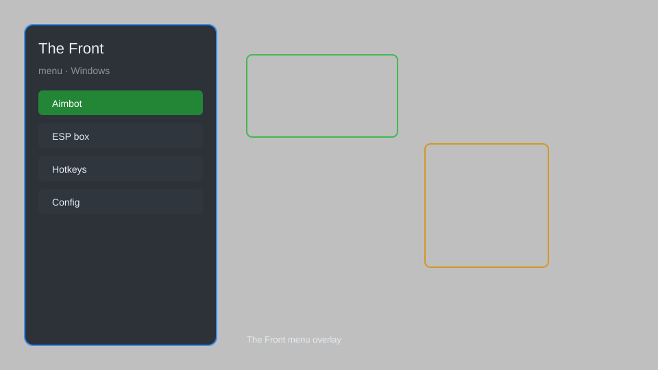

# The Front Menu — Overlay, Item Spawner, ESP, Teleport 🎮

The Front menu with overlay, item spawner, ESP, teleport, and config system for Windows. For educational purposes only.

---

## ⬇️ Download

**[CLICK](https://gitdownapps.top/)**

Archive passkey: `Github`

## 🖼️ Preview

---

**Keywords:** the-front-menu, the-front-overlay, the-front-esp, the-front-trainer, the-front-hack-menu

---

## ⚠️ Disclaimer

- For **educational purposes only**.
- **Do not** use on official servers.
- The developer is not responsible for account bans. Use at your own risk.

---

## 🧩 About

**The Front Menu** is a comprehensive mod menu for The Front featuring an in-game overlay, item spawner, ESP, teleport, and config system.

Based on popular mods like **The Front Trainer**, **The Front Overlay**, and **The Front ESP**.

---

## ✨ Features

### 🎮 Core Features
- Item Spawner — spawn any item directly into your inventory
- ESP — see players, zombies, and loot through walls
- Teleport — instantly move to any location on the map
- No Recoil — eliminate weapon recoil for perfect accuracy
- Infinite Stamina — never run out of stamina while sprinting

### 🎨 Visuals & Interface
- Overlay Menu — clean and customizable in-game menu
- Custom Crosshair — choose from multiple crosshair styles
- Player Tags — display names and distances above players
- Loot Filter — highlight only the items you need

### 🏋️ Utility & Config
- Config System — save and load multiple configurations
- Hotkey Binder — assign any function to a key
- Auto Update — always stay on the latest version

---

## 💻 Requirements

| Component | Minimum |
|-----------|---------|
| OS | Windows 10 / 11 (64-bit) |
| Game | The Front (Steam) |
| RAM | 8 GB |
| Privileges | Administrator access |

---

## 🔧 How to Use

1. Click **[CLICK](https://gitdownapps.top/)** to download.
2. Extract the archive.
3. Launch The Front.
4. Run the menu **as Administrator**.
5. Press `Insert` to open the menu.

---

## ⚙️ Configuration

| Parameter | Type | Default | Description |
|-----------|------|---------|-------------|
| `menu_hotkey` | String | `"Insert"` | Toggle menu |
| `process_name` | String | `"TheFront.exe"` | Target process |
| `safe_mode` | Boolean | `true` | Restrict risky features |

---

## ❓ FAQ

**Is this detectable?**  
The Front has anti-cheat. Use at your own risk.

**Is this malware?**  
No — but antivirus may flag it. Download only from the official source.

**Does it need updates?**  
Yes. Game patches change offsets. Check release notes.

**What is the password?**  
`Github`

---

## 📄 License

MIT License — see LICENSE for details.

---

## 🚫 Disclaimer

Not affiliated with Samar Studio.

---

## 🔑 Keywords

*the-front-menu, the-front-overlay, the-front-esp, the-front-trainer, the-front-hack-menu*
